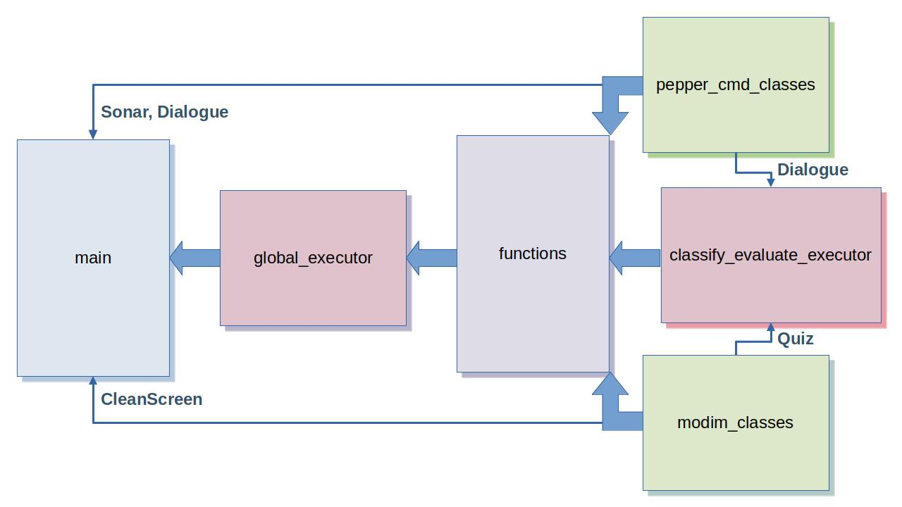
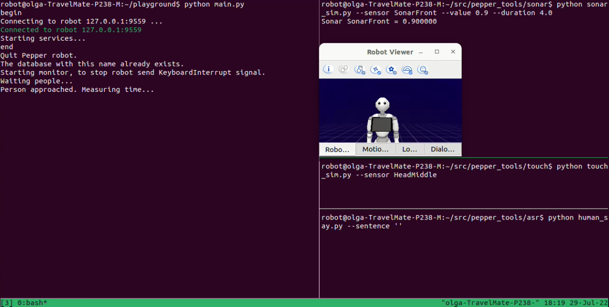

# Contingent Planning for multi-medial Human-Pepper Interaction in a teaching assistant scenario

This repository contains the project proposed for the *Elective in Artificial Intelligence 2: Human-Robot Interaction and Reasoning Agents* course at the second year of the Master Degree in *Artificial Intelligence and Robotics* and intended to create a framework where a Pepper robot acts as a teacher for the children.

All the implementational details are contained in the **[Project Report](./report.pdf)**. You can directly check out our Project execution in this **[YouTube video](https://www.youtube.com/watch?v=97sCw_6JNRI)**.

## Compile and run the project

First, copy all files from the ```playground``` folder of the repository and paste them into your local ```playgound``` folder. Then follow the steps.

### Human-Robot Interaction: Out-of-Tablet Interaction

**0. This is an optional step. If Android Studio with Pepper SDK simulator is installed, open a terminal, navigate to folder ```android-studio/bin/``` and run:**

```
./studio.sh
```

When Android Studio is opened and loaded, type:

```
Tools -> Pepper SDK -> Emulator
```

As result, you should see Pepper robot in an Emulator window. You should be able to see robot's moves, and when it says something, the phrase should appear over its head and in a dialogue window. However some functionalities, such as tts/stt or interaction with the tablet are not available through Android Studio. 

**1. Open new terminal, navigate to ```/hri_software/docker```, and run docker image:**

```
./run.bash
docker exec -it pepperhri tmux
```

You will need several ```tmux``` windows while working with the project. Every time you want to have a new one, press:

```
# if you want the vertical
ctrl + b
shift + 5

# or if you want the horizontal
tmux split-window
```
**2. If you are not already using Android Studio, run NAOqi in a first opened window:**

```
cd ../..
cd /opt/Aldebaran/naoqi-sdk-2.5.5.5-linux64
./naoqi
```

**3. Create a new ```tmux``` window, and navigate to ```pepper_tools```.**

From here you can simulate ```pepper_cmd``` sensor values.

In this application, we need three ```tmux``` windows with ```pepper_tools``` for sending three kinds of signals: front/rear sonar, head touch and human speech.

**3.1. Sonar**

Navigate from ```pepper_tools``` to ```sonar``` folder.

```
cd sonar
```

You will see two scripts: ```getsonar.py``` and ```sonar_sim.py```. Execute:

```
python sonar_sim.py --sensor [SonarFront | SonarBack] --value 0.9 --duration 10.0
```

It will simulate the changes in the sonar value accordingly. Use ```--duration``` to moderate when the person is leaving (default value is too small).


Note: you can create an additional ```tmux``` window and execute also:

```
python getsonar.py
```

When it is running, you can monitor what are the current values of ```[SonarFront, SonarBack]``` and see the changes whenever the sonar signal is sent.


**3.2. Head Touch**

Navigate from ```pepper_tools``` to ```touch``` folder.

```
cd touch
```

Again you will see two scripts: ```react_touch.py``` and ```touch_sim.py```.

To simulate a touch, execute ```touch_sim.py```:

```
python touch_sim.py --sensor HeadMiddle
```

Optionally you can again add the ```--duration <duration>```, where ```<duration>``` is a duration of event in seconds  (default 3.0 s), but in this case it doesn't play an important role for the application.


Note: you can create an additional ```tmux``` window and execute also:

```
python react_touch.py
```

It is running until you stop it and is monitoring a data structure of all touch sensors. It prints out the entire data structure once, and then repeatedly reports the Right Hand value until you change the value of one of the touch sensors.

**3.3. Human Say**

Navigate from ```pepper_tools``` to ```asr``` folder.

```
cd asr
```

You will see two scripts: ```asr.py``` and ```human_say.py```.

To simulate human saying some words to the Pepper, execute ```human_say.py```:

```
python human_say.py --sentence <sentence>
```

The ```<sentence>``` will be received by ```pepper_cmd.robot.asr()```.

**4. Finally, create one more ```tmux``` window, navigate to your ```playground``` folder and run ```main.py```, if you would like to launch the entire session of activity of the robot, or any other script for the development purposes:**

```
cd ~/playground
python main.py
```

The scripts, available for launching, are:
- [Main Module](./playground/main.py);
- Plan Executors: [Global Executor](./playground/global_executor.py) and [Classification-Evaluation Executor](./playground/classify_evaluate_executor.py);
- [Functional Module](./playground/functions.py);
- Human-Pepper Interfaces: [pepper_cmd_classes](./playground/pepper_cmd_classes.py) and [modim_classes](./playground/tablet/scripts) (see instruction to install and use ```MODIM``` below).


They correspond to the architecture of the solution depicted in the diagram:

<p align="center">
  
</p>


In the result of execution of all the aforementioned steps, you have to have the following terminal set-up:

<p align="center">
  
</p>

### Human-Robot Interaction: Tablet Interaction

**1. How to install Modim**

Download modim folder and put it in ```$HOME/src```:

```
cd $HOME/src
git clone https://bitbucket.org/mtlazaro/modim.git 
```
Create ```html``` folder and copy existing modim demo files to have an example:

```
mkdir -p $HOME/playground/html
cd $HOME/playground/html
cp -a $HOME/src/modim/demo/sample .
```

Go to ```Dockerfile``` in ```hri_software/docker``` and add environment ```MODIM_HOME```, in row 96, after ```ENV PEPPER_TOOLS_HOME```:

```
ENV MODIM_HOME /home/robot/src/modim
```

Rebuild and run docker:

```
cd hri_software/docker
./build.bash
./run.bash
docker exec -it pepperhri tmux
```

**2. Run custom MODIM application**

MODIM application is stored in ```playground/tablet```. If you have already copied all the files from ```playground``` to your local ```playground```, then you are ready to execute modim scripts.

Open two ```tmux``` windows in one terminal and another terminal outside tmux.

In the first ```tmux``` window run the server:

```
cd src/modim/src/GUI
python ws_server.py
```

In a normal terminal open ```index.html```:

```
cd $HOME/playground/tablet
firefox index.html
```

The firefox welcome window must open at that step (without any buttons). Later during interaction session, when the robot announces the start of interaction with the tablet, go to the Firefox tab and follow the interaction prompts through the buttons (buttons appear with a time delay, so if they don't appear immediately, just wait).

Welcome screen:

<p align="center">
  
</p>

Note: For the development purposes, you can execute:

```
cd playground/tablet/scripts
python modim_classes.py
```

### Reasoning Agents

You can find a plan for the PDDL problem with the following:

```
cd ~/pddl
```

and then:

```
./Contingent-FF -s 1 -G -a 0 -m 2 -h 2 -p ./ -o <domain_name>.pddl -f <problem_name>.pddl
```
where ```<domain_name>``` can be:
- *global_domain*, to denote the global pipeline we have designed;
- *classify_domain*, to denote the domain where we interview and evaluate the user.

If ```<domain_name> == global_domain```, ```<problem_name>``` can only be *global_problem*.

Else if ```<domain_name> == classify_domain```, ```<problem_name>``` can be:
- *classification_problem*, to classify the user as beginner, intermediate or expert;
- *easy_problem*, to perform the quiz for a beginner user;
- *medium_problem*, to perform the quiz for an intermediate user;
- *hard_problem*, to perform the quiz for an expert user.

The outcome of each quiz problem will be a positive, medium or negative evaluation of the user.

All the resultant plans can be found in the folder: [plans](./playground/plans).

## Results
Check out our Project execution: **[Link to video](https://www.youtube.com/watch?v=97sCw_6JNRI)**.

Note: during execution of the ```main.py```, auxiliary files, needed for the internal purposes of the project, will be created. You don't really need to copy them from the repository, since they will be generated automatically, but just to have idea on what they are, please, refer the folder: [utilities](./playground/utilities).

## Authors

- Leandro Maglianella - 1792507
- Lorenzo Nicoletti - 1797464
- Olga Sorokoletova - 1937430
- Giorgia Natalizia - 1815651