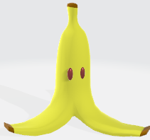
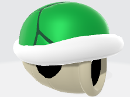
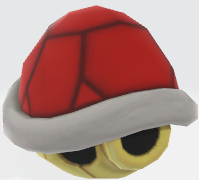
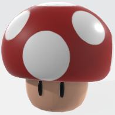
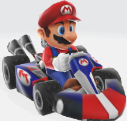
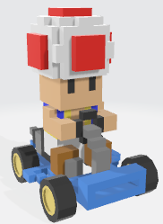
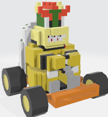
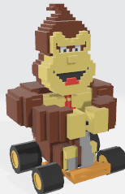

# Interactive Graphics final project

This is the repository of the final project of the Interactive Graphics course.

The proposed work is a personal re-implementation of the famous racing game [Mario Kart](https://it.wikipedia.org/wiki/Mario_Kart) produced by [Nintendo](https://www.nintendo.com/). The adopted library is [BabylonJS](https://www.babylonjs.com/) (version 4.2).

Please, refer to the *Game Link* section below to play and interact with the game.

***Observation:*** We strongly recommend to play this game on **Google Chrome**; even if it works fine on the most used web browsers as well, we have noticed a more usable and enjoyable experience on that specific browser.

## How to play

### Commands

- **W**, **A**, **S** and **D** to move the car along the race track;
- **E** to use the item collected if one of the item boxes is hit;
- **R** to restart the race;
- ←, ↑, → and ↓ to move the camera.

### Item effects

We provide four different items in the scene, each of them has a specific effect on the racers according to the *Mario Kart* game literature. The available items are:
- **banana**, if a car hits this object it will do a spin;

- **green shell**, if used it will follow a straight trajectory and may hit a car along its path;

- **red shell**, if used it will follow a target car in front of the user car and there is a high probability to hit it;

- **mushroom**, if used it will give a huge sprint to the car for some seconds.

An item will be randomly available if one of the item boxes on the tracks is crossed over.

### Race Modalities

We provide two race modalities that the user can select:
- **Grand Prix**, a little tournament of three races where a cumulative score is computed from the respective placements in each of them;
- **Single race**, if the user wants to run one race only, just select the single race track in the game's main menu.

Every race is composed of three laps and is a competition between the user car and three other CPU-controlled cars. We have implemented three different race tracks freely inspired on the originals by Nintendo: these are *Luigi Circuit*, *Bowser's Castle* and *Rainbow Road* such that each of them has its own peculiarities and personalized characteristics.

### Character selection

The user is free to select one of the four players provided in the game. We offer the possibility to choose between some of the most loved *Mario Kart* icons:
- **Mario**;

- **Toad**;

- **Bowser**;

- **Donkey Kong**.

### Start the game

Once selected the desired race modality and character, the user can start racing.

## Project utilities

### Game Link

### [Click here to play the game](https://sapienzainteractivegraphicscourse.github.io/final-project-ll-team/).

### Report

For further details, the report of the project is available in this repository at [this link](./report.pdf).

### Gameplay

If needed, we provide a demonstrative gameplay available at [this link](https://www.youtube.com/watch?v=n5YD2v_OD2o) to show how the interaction with our game should be.

## Authors

- Lorenzo Nicoletti - 1797464

- Leandro Maglianella - 1792507

