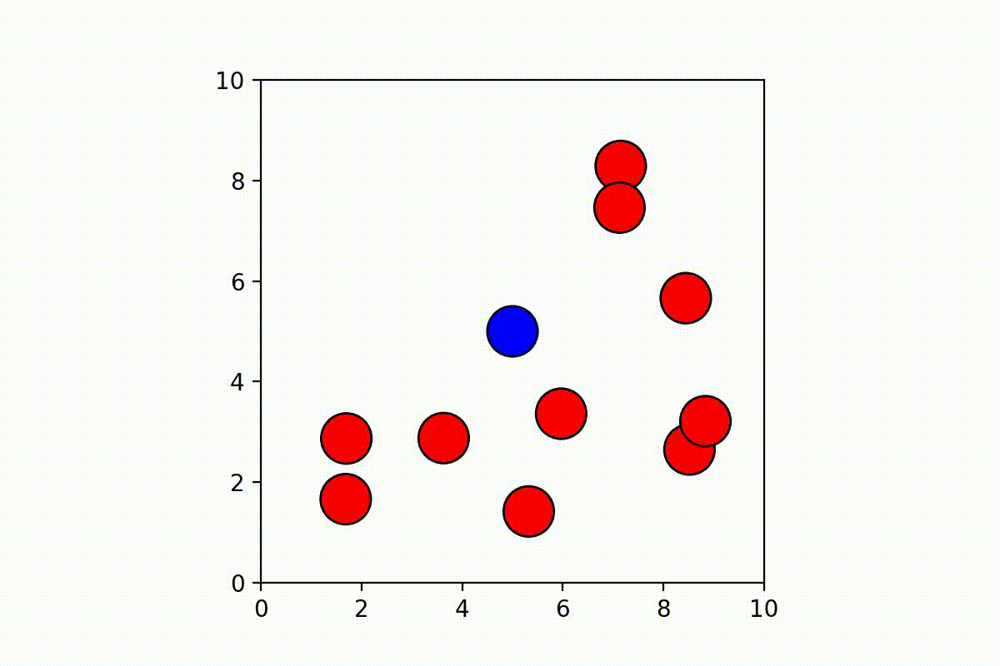
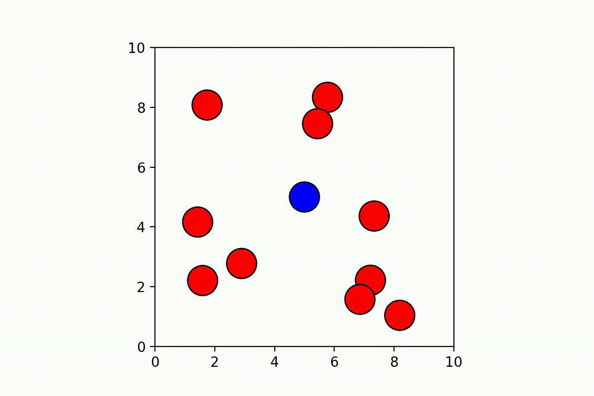

# Path Planning with Dynamic Obstacles using Velocity Obstacles and Nonlinear Model Predictive Control

This is the repository of the project proposed for the course of *Planning and Reasoning*. Refer to the [report](./report.pdf) for further details.

## Simulations and results

Running a simulation in the notebook is extremely simple: after the execution of the *Definitions* cells, it is just needed to specify a set of desired experimental parameters to be ready to start an experiment.

**VO Results:**

 
 
 

**NMPC Results:**

 
 
 

