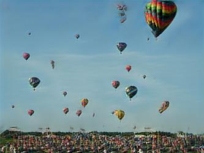

# Vision & Perception project

This is the repository for the project of the **Vision & Perception** course.

Our work is based on the paper [SinGAN: Learning a Generative Model from a Single Natural Image](https://arxiv.org/abs/1905.01164) and contains a personal extension too. In particular, this project is based on:
- a re-implementation of the aforementioned original paper in *TensorFlow 2*, where we have created a version of the random generation process of a simple image containing balloons.

- an extension of this process that focuses on the extreme case of face generation; we have tested three faces at three different scales and tried to replicate them taking into account the high importance of their global structure.

  

- a slightly different version of [Face Inpainting](https://paperswithcode.com/task/facial-inpainting), where our already-trained SinGAN fills the masked area of an image and tries to re-create realistic faces starting from the three original ones below.

  

If you open the [notebook](./project.ipynb) on **Google Colab**, you are free to interact with our GUIs to set your own experiment or replicate our results, that are collected in the 'models' and 'results' folders available in this repository.

## Run the project

The project is self-contained in one single file where the user is free to interact by setting the modalities of the experiment in the proper GUI that is only visible with Google Colab.

### Training

In case of training, the user just needs to switch the **mode** option to *"train"* or *"train+test"*. We provide an interface to *TensorBoard* too to visualize the losses involved in the SinGAN learning.

We strongly suggest to adopt the following values for your experiments:
| Image | max_size | scale_attr |
| ---      | ---      | ---      |
| balloons   |  250   | 0.75   |
| face1   |  250   | 0.6   |
|  face1  | 365  |  0.55   |
|  face1  | 480  |  0.5   |
| face2   |  250   | 0.6   |
|  face2  | 365  |  0.55   |
|  face2  | 480  |  0.5   |
| face3   |  250   | 0.6   |
|  face3  | 365  |  0.55   |
|  face3  | 480  |  0.5   |

The model weights will be automatically saved to the corresponding directory in the 'models' folder.

### Testing

In case of testing, the user just needs to switch the **mode** option to *"test"* or *"train+test"*. We underline the fact that SinGAN needs to be already trained on the specific image you want to test.

## Results

### Random Samples

| Original image | Best results (for faces, one per scale) |
| ---      | ---  |
|   |    |
|  |    |
|  |   |
|  |    |

### Face Inpainting

As already mentioned, this is a variation of the traditional Face Inpainting task: our model is not trained on uncompleted (or masked) images but, at testing phase, it just tries to fill the masked area and realize coherent faces.

| Masked image | Best results (for faces, one per scale) |
| ---      | ---  |
|  |    |
|  |    |
|  |    |

## Authors

#### - Lorenzo Nicoletti - 1797464

#### - Leandro Maglianella - 1792507

